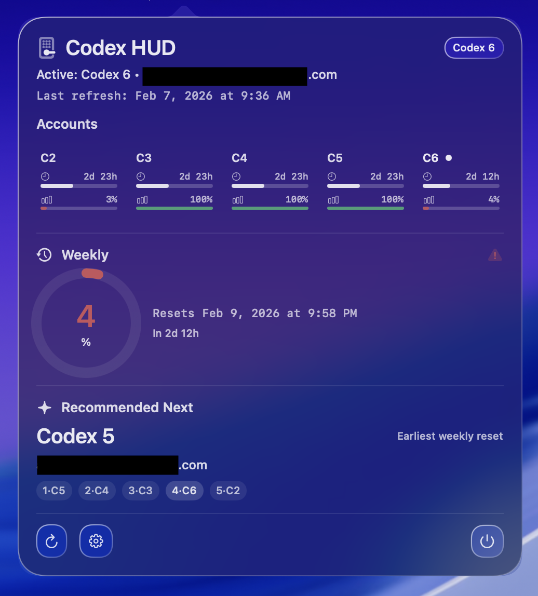

# Codex HUD

Codex HUD is a macOS menu bar application for managing Codex usage across accounts. It ingests local Codex session data, models usage state with strongly typed domain logic, and recommends the next account to use based on weekly reset timing and remaining capacity.

<p align="center">
  
</p>

## Why This Exists
- Codex usage constraints are multi-windowed and account-scoped.
- Weekly capacity is the highest-value resource and should drive switching decisions.
- Manual tracking across accounts is error-prone and wastes reset opportunities.
- A local-first desktop assistant gives immediate visibility without introducing backend risk.

## Core Capabilities
- Weekly-first dashboard with 5-hour context for the active account.
- Automatic active-account detection from local auth state.
- Incremental ingestion of `token_count` events from Codex session logs.
- Deterministic recommendation engine with stickiness and reset-aware prioritization.
- Notification evaluation on threshold crossings (`30%`, `15%`, `5%` remaining).
- Local persistence with migration and backup safeguards.

## Architecture Overview
`CodexHudCore` owns domain behavior and policy logic.
`CodexHudApp` owns presentation, orchestration, and system integrations.
`CodexHudAutomation` is an optional executable for scheduled policy actions.

### Data Flow
```text
~/.codex/auth.json + ~/.codex/sessions/**/rollout-*.jsonl
            |
            v
   AuthDecoder + SessionLogIngestor
            |
            v
   CodexHudCore domain models/policies
            |
            v
   AppStateStore (Application Support/state.json)
            |
            v
 AppViewModel + NotificationManager + SwiftUI Menu UI
```

## Design Choices
- Local-first ingestion over API polling: eliminates external dependencies and privacy exposure while keeping latency low.
- Strong typing at domain boundaries: `Percent`, usage-window models, and evaluators reduce invalid state propagation.
- Policy-driven decision engines: recommendation, notifications, refresh gating, and reminders are explicit and testable.
- Event-driven refresh with safety net: file watchers provide immediate updates; periodic health checks prevent drift.
- Deterministic recommendation ordering: earliest weekly reset first, with clear tie-breaking on remaining capacity.
- Resilient storage lifecycle: atomic writes, backup rotation, and migration handling protect continuity.

## Reliability and Operational Behavior
- Reads only the newest relevant log window through tail-based and incremental parsers.
- Applies assumed reset logic when a stored reset passes while fresh logs are unavailable.
- Debounces repeated threshold notifications by keeping a notification ledger in state.
- Isolates automation decisions behind cooldown and window policies to avoid runaway behavior.

## Privacy and Security
- All state stays local in `~/Library/Application Support/<bundle-id>/state.json`.
- No telemetry, no analytics, no external service dependencies.
- Tokens are not persisted by this app; JWT data is decoded in memory only for identity derivation.

## Requirements
- macOS 15+
- Swift 6.2 toolchain (Xcode 16+ recommended)
- Codex CLI installed and authenticated (`~/.codex` present)

## Quick Start
```bash
./scripts/run-app.sh
```

## Build and Install
Build app bundle:
```bash
./scripts/build-app.sh
open .build/CodexHudApp.app
```

Install into `~/Applications`:
```bash
./scripts/install-app.sh
open ~/Applications/CodexHudApp.app
```

## Configuration
1. Open **Settings** from the popover.
2. Map `Codex 2` through `Codex 6` to unique account emails.
3. Enable notifications if needed.

## Development and Verification
Run tests:
```bash
swift test
```

Run lint/format checks (if installed):
```bash
./scripts/lint.sh
```

## Project Layout
```text
Sources/
  CodexHudCore/        # Domain models, parsing, recommendation, policy evaluators, storage
  CodexHudApp/         # Menu bar UI, view model, file watchers, notifications
  CodexHudAutomation/  # Optional scheduled automation entry point
Tests/
  CodexHudCoreTests/   # Parser, recommendation, scheduling, state, and notification tests
scripts/               # Build, run, install, lint utilities
docs/images/           # README assets
```

## Scope Boundaries
- Single-user, local machine workflow.
- No credential management or account switching automation.
- No cloud sync or multi-device state sharing.
