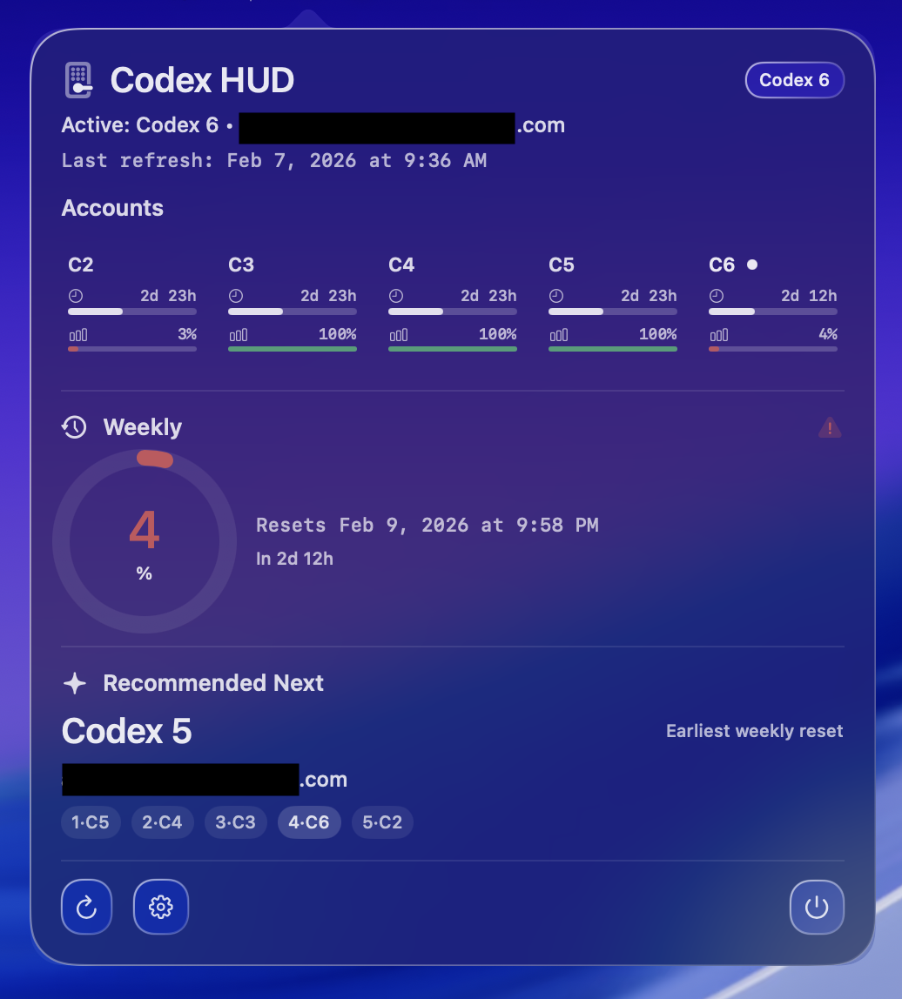
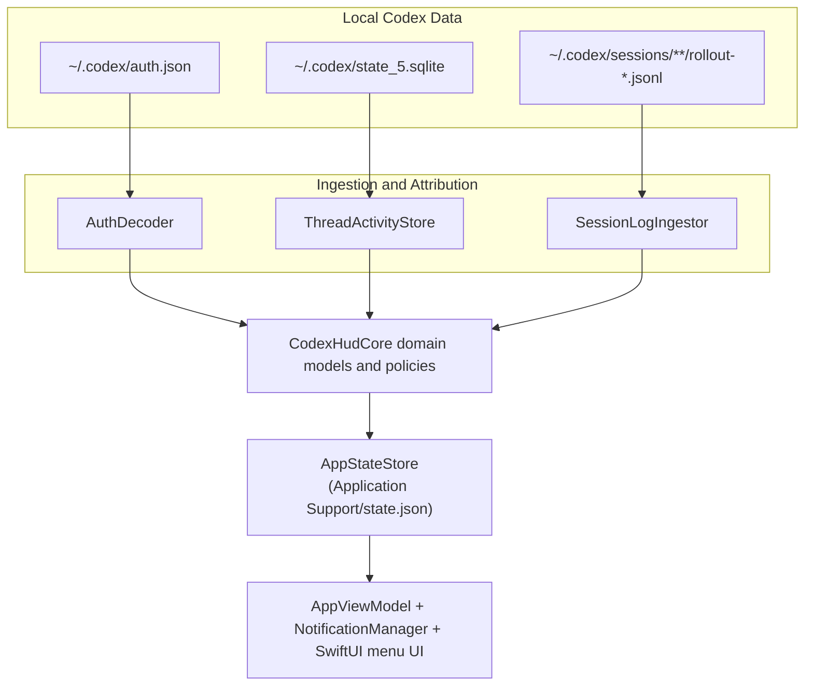

# Codex HUD

Codex HUD is a private macOS menu bar app for tracking Codex usage across five accounts. It reads local Codex session activity, attributes live sessions to the right configured account, and recommends when to stay put or switch based on weekly reset timing and remaining capacity.

<p align="center">
  
</p>

## At a Glance
- Tracks five configured Codex accounts from local machine data only.
- Follows the latest mapped live Codex session instead of relying solely on the current auth file.
- Shows weekly remaining first, with 5-hour context for the active account.
- Recommends the next best account to use with deterministic, reset-aware prioritization.
- Can optionally send a minimal `"hi"` message for guarded timer kick-off and refresh recovery.

## Why This Exists
- Codex usage constraints are multi-windowed and account-scoped.
- Weekly capacity is the highest-value resource and should drive switching decisions.
- Manual tracking across accounts is error-prone and wastes reset opportunities.
- A local-first desktop assistant gives immediate visibility without introducing backend risk.

## Core Capabilities
- Weekly-first dashboard with 5-hour context for the active account.
- Automatic active-account detection from the latest mapped live Codex session, with auth used only to bind newly observed sessions.
- Incremental ingestion of `token_count` events from Codex session rollouts.
- Deterministic recommendation engine with stickiness and reset-aware prioritization.
- Notification evaluation on threshold crossings (`30%`, `15%`, `5%` remaining).
- Optional headless automation to send a minimal Codex message (`"hi"`) for timer kick-off and refresh recovery.
- Local persistence with migration and backup safeguards.

## Design Choices
- Local-first ingestion over API polling: eliminates external dependencies and privacy exposure while keeping latency low.
- Strong typing at domain boundaries: `Percent`, usage-window models, and evaluators reduce invalid state propagation.
- Policy-driven decision engines: recommendation, notifications, refresh gating, and reminders are explicit and testable.
- Event-driven refresh with safety net: SQLite thread activity and rollout watchers provide immediate updates; periodic health checks prevent drift.
- Deterministic recommendation ordering: earliest weekly reset first, with clear tie-breaking on remaining capacity.
- Resilient storage lifecycle: atomic writes, backup rotation, and migration handling protect continuity.

## Reliability and Operational Behavior
- Reads only the newest relevant rollout window through tail-based parsing and a bounded recent-thread query from Codex's local SQLite state.
- Applies assumed reset logic when a stored reset passes while fresh logs are unavailable.
- Debounces repeated threshold notifications by keeping a notification ledger in state.
- Isolates automation decisions behind cooldown and window policies to avoid runaway behavior.

## Privacy and Security
- All state stays local in `~/Library/Application Support/<bundle-id>/state.json`.
- No telemetry, no analytics, no external service dependencies.
- Tokens are not persisted by this app; JWT data is decoded in memory only for identity derivation.

## Requirements
- macOS 15+
- Swift 6.2 toolchain (Xcode 16+ recommended)
- Codex CLI installed and authenticated (`~/.codex` present)

## Quick Start
Clone, build, install, and launch in one flow:
```bash
git clone https://github.com/Capedbitmap/codex-hud.git
cd codex-hud
./scripts/install-and-run.sh
```

What this does:
- Builds the app from source.
- Installs it to `~/Applications/CodexHudApp.app`.
- Opens the app after install.

If you only want to install without launching:
```bash
./scripts/install-and-run.sh --no-open
```

## Install and Run (First Time)
After first install, launch from Finder (`~/Applications/CodexHudApp.app`) or run:
```bash
open ~/Applications/CodexHudApp.app
```

## First-Time Setup
1. Open **Settings** from the popover.
2. Map `Codex 1` through `Codex 5` to unique account emails.
3. Enable notifications if needed.
4. Use Codex normally. Once local session activity exists, the HUD will begin attributing usage.

If account or usage data is empty, first confirm Codex CLI is installed and authenticated (`~/.codex/auth.json` exists), then generate fresh Codex activity so recent rollout data exists under `~/.codex`.

## How It Decides the Active Account
Codex HUD does not treat the current auth file as the whole truth. Instead, it combines multiple local signals:
- Recent thread activity from Codex's local SQLite state (`~/.codex/state_5.sqlite`).
- Session metadata and `token_count` updates from rollout files under `~/.codex/sessions`.
- Auth observations to bind newly seen sessions to configured account emails.

In practice, this means the app follows the most recently active mapped live session, while still using auth state as a fallback when a new session first appears.

## Daily Use
- Open the menu bar popover to see the active account, weekly remaining, 5-hour window, and recommendation.
- Use **Refresh** when you want an immediate rescan of local Codex state.
- Open **Settings** to update account mappings or notification permissions.

## Architecture Overview
`CodexHudCore` owns domain behavior and policy logic.
`CodexHudApp` owns presentation, orchestration, and system integrations.
`CodexHudAutomation` is an optional executable for scheduled policy actions.

### Data Flow

```mermaid
flowchart TD
    subgraph Codex["Local Codex Data"]
        Auth["~/.codex/auth.json"]
        Threads["~/.codex/state_5.sqlite"]
        Rollouts["~/.codex/sessions/**/rollout-*.jsonl"]
    end

    subgraph Ingestion["Ingestion and Attribution"]
        AuthDecoder["AuthDecoder"]
        ThreadStore["ThreadActivityStore"]
        LogIngestor["SessionLogIngestor"]
    end

    Core["CodexHudCore domain models and policies"]
    State["AppStateStore\n(Application Support/state.json)"]
    UI["AppViewModel + NotificationManager + SwiftUI menu UI"]

    Auth --> AuthDecoder
    Threads --> ThreadStore
    Rollouts --> LogIngestor

    AuthDecoder --> Core
    ThreadStore --> Core
    LogIngestor --> Core

    Core --> State
    State --> UI
```

## Headless Automation (Optional)
Start 5-hour countdown automation manually:
```bash
./scripts/run-daily-hello.sh --daily-hello
```

Run weekly-aware forced refresh manually:
```bash
./scripts/run-forced-refresh.sh
```

Daily hello (`--daily-hello`) sends `"hi"` only when all policy checks pass:
- Time window is 06:00-20:00 local time.
- Maximum 3 sends per day.
- Minimum 4 hours since the previous send.
- 5-hour window has not already started for the active account.
- Weekly remaining is above depleted threshold.

Forced refresh (`--forced-refresh`) sends `"hi"` only when all policy checks pass:
- Weekly remaining is above depleted threshold.
- At least 12 hours since previous forced-refresh attempt.
- No forced-refresh failure in the last 24 hours.

Install a launch agent for scheduled daily hello:
```bash
./scripts/install-launch-agent.sh
```

Remove that launch agent:
```bash
./scripts/install-launch-agent.sh --unload
```

Default automation model is `gpt-5.1-codex-mini`. Override with `CODEX_HUD_HELLO_MODEL`.

## Development Scripts
Build app bundle only:
```bash
./scripts/build-app.sh
```

Build and run from `.build`:
```bash
./scripts/run-app.sh
```

Install/update app in `~/Applications` without opening:
```bash
./scripts/install-app.sh
```

Install or remove launchd automation:
```bash
./scripts/install-launch-agent.sh
./scripts/install-launch-agent.sh --unload
```

## Development and Verification
Run tests:
```bash
swift test
```

Run lint/format checks (if installed):
```bash
./scripts/lint.sh
```

## Project Layout
```text
Sources/
  CodexHudCore/        # Domain models, parsing, recommendation, policy evaluators, storage
  CodexHudApp/         # Menu bar UI, view model, file watchers, notifications
  CodexHudAutomation/  # Optional scheduled automation entry point
Tests/
  CodexHudCoreTests/   # Parser, recommendation, scheduling, state, and notification tests
scripts/               # Build, run, install, lint utilities
LaunchAgents/          # launchd template(s) for optional automation
.github/               # CI, CODEOWNERS, and PR template
docs/images/           # README assets
```

## Scope Boundaries
- Single-user, local machine workflow.
- No credential management or account switching automation.
- No cloud sync or multi-device state sharing.

## Troubleshooting
### No usage data appears
- Confirm Codex CLI is installed and authenticated.
- Confirm `~/.codex/auth.json` exists.
- Generate fresh Codex activity so new rollout files and thread updates exist.
- Use the popover **Refresh** action to trigger an immediate rescan.

### The active account looks wrong
- Verify the email mappings in **Settings** are correct and unique.
- Generate activity in the session you expect to be active; the HUD prefers the most recently active mapped live thread.
- If you recently switched accounts, use **Refresh** to rescan auth observations and rollout data immediately.

### Notifications do not appear
- Enable notifications in the app settings flow.
- If macOS previously denied access, re-enable notifications in System Settings.

## Contributing
Contributions are welcome via pull requests. See `CONTRIBUTING.md` for workflow, required checks, and branch-protection recommendations.

## License
This project is licensed under `PolyForm-Noncommercial-1.0.0`. See `LICENSE`.

Commercial use is not permitted under this license. If you need a commercial license, see `COMMERCIAL-LICENSE.md` or contact `warm_doublet1b@icloud.com`.

This repository also includes a required attribution notice in `NOTICE`. If you redistribute this software, preserve that notice and provide this license text or URL as required by the license.
